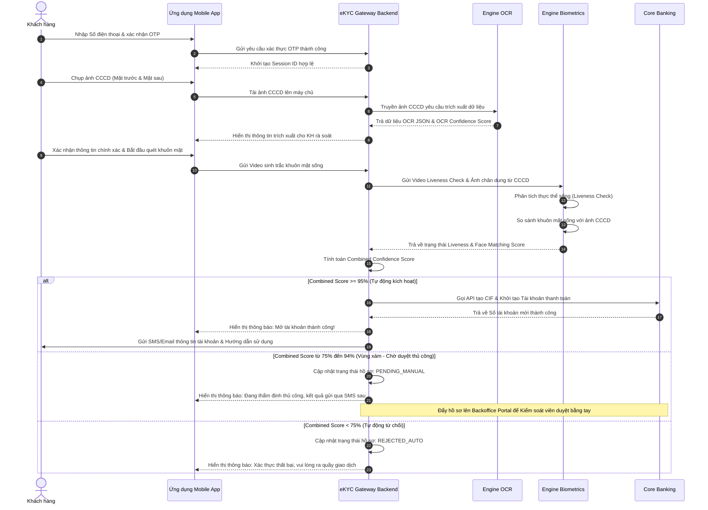

# SOFTWARE REQUIREMENTS SPECIFICATION (SRS)
## HỆ THỐNG MỞ TÀI KHOẢN TRỰC TUYẾN QUA ĐỊNH DANH eKYC - ABC BANK
**Tiêu chuẩn áp dụng:** IEEE Std 830-1998  
**Phiên bản:** 1.0.0  
**Trạng thái:** Sẵn sàng cho Phát triển & Kiểm thử  
**Tác giả:** Senior Business Analyst & Software Architect  

---

## MỤC LỤC
1. [PHẦN 1: INTRODUCTION (GIỚI THIỆU CHUNG)](#phần-1-introduction-giới-thiệu-chung)
   - 1.1. Purpose (Mục đích)
   - 1.2. Scope (Phạm vi hệ thống)
   - 1.3. Definitions, Acronyms (Bảng thuật ngữ và chữ viết tắt)
2. [PHẦN 2: OVERALL DESCRIPTION (MÔ TẢ TỔNG QUAN)](#phần-2-overall-description-mô-tả-tổng-quan)
   - 2.1. Product Perspective (Góc nhìn sản phẩm)
   - 2.2. User Classes and Characteristics (Nhóm người dùng và đặc điểm)
   - 2.3. Constraints (Các giới hạn ràng buộc)
3. [PHẦN 3: SPECIFIC FUNCTIONAL REQUIREMENTS (YÊU CẦU CHỨC NĂNG CHI TIẾT)](#phần-3-specific-functional-requirements-yêu-cầu-chức-năng-chi-tiết)
   - 3.1. Module 01: Đăng ký tài khoản & Xác thực OTP
   - 3.2. Module 02: Upload & Đọc thông tin CCCD (OCR)
   - 3.3. Module 03: Xác thực khuôn mặt sinh trắc học (Liveness Check & Face Matching)
   - 3.4. Module 04: Đối chiếu điều kiện và Tự động kích hoạt tài khoản
4. [PHẦN 4: NON-FUNCTIONAL REQUIREMENTS (YÊU CẦU PHI CHỨC NĂNG)](#phần-4-non-functional-requirements-yêu-cầu-phi-chức-năng)
   - 4.1. Security (Bảo mật)
   - 4.2. Performance (Hiệu năng)
   - 4.3. Availability & Reliability (Độ sẵn sàng và Độ tin cậy)
5. [PHẦN 5: VISUAL DIAGRAM (SƠ ĐỒ TRỰC QUAN)](#phần-5-visual-diagram-sơ-đồ-trực-quan)
   - 5.1. Use Case Diagram (Mã nguồn Mermaid.js)
   - 5.2. Luồng xử lý dữ liệu & Ra quyết định eKYC

---

## PHẦN 1: INTRODUCTION (GIỚI THIỆU CHUNG)

### 1.1. Purpose (Mục đích)
Tài liệu Đặc tả Yêu cầu Phần mềm (SRS) này xác định chi tiết các yêu cầu chức năng và phi chức năng cho hệ thống định danh điện tử eKYC phục vụ việc mở tài khoản trực tuyến của Ngân hàng TMCP ABC (ABC Bank).  
Tài liệu này được biên soạn theo cấu trúc chuẩn quốc tế **IEEE Std 830-1998**, nhằm cung cấp một nguồn thông tin chuẩn hóa duy nhất (Single Source of Truth) giúp:
*   **Đội ngũ Phát triển (Developers):** Nắm rõ cấu trúc luồng đi dữ liệu, nghiệp vụ tích hợp API ngoại vi, điều kiện rẽ nhánh logic và các quy tắc nghiệp vụ bảo mật để hiện thực hóa mã nguồn chính xác.
*   **Đội ngũ Kiểm thử (QA/Tester):** Có căn cứ rõ ràng để xây dựng ma trận kiểm thử (Test Matrix), viết kịch bản kiểm thử chi tiết (Test Cases/Test Scenarios) cho cả chức năng, bảo mật và hiệu năng tải.
*   **Các bên liên quan (Product Owners, Risk Management):** Đồng thuận về phạm vi nghiệp vụ và tiêu chuẩn chất lượng đầu ra của sản phẩm trước khi đưa vào vận hành thực tế.

### 1.2. Scope (Phạm vi hệ thống)

#### 1.2.1. Phạm vi nằm trong hệ thống (In-Scope)
*   **Hệ thống cổng giao tiếp khách hàng (Mobile Application & API Gateway):** Thu thập dữ liệu đầu vào bao gồm Số điện thoại, mã xác thực OTP, hình ảnh giấy tờ tùy thân (CCCD) và dữ liệu quét sinh trắc học khuôn mặt từ camera thiết bị di động.
*   **Engine xử lý OCR:** Tích hợp bộ thư viện/dịch vụ trích xuất ký tự quang học từ ảnh chụp CCCD mặt trước, mặt sau; nhận diện các dấu hiệu giấy tờ giả mạo vật lý (lóa sáng, cắt góc, chụp từ màn hình, photocopy).
*   **Engine xác thực sinh trắc học (Liveness Check & Face Matching):** Kiểm tra tính sống của thực thể trước camera (Liveness Detection) nhằm ngăn ngừa giả mạo khuôn mặt bằng ảnh/video/mặt nạ 3D; đối chiếu khuôn mặt sống với ảnh chụp chân dung trên CCCD để đưa ra điểm số trùng khớp.
*   **Engine quyết định (Decision Engine):** Tổng hợp điểm số tin cậy (Confidence Score), thực hiện kiểm tra Blacklist/AML/PEP và áp dụng các quy tắc nghiệp vụ rẽ nhánh tự động (Thành công trực tiếp đối với Score $\ge$ 95%, Chuyển duyệt thủ công đối với Score từ 75% đến 94%, Từ chối trực tiếp đối với Score < 75%).
*   **Hệ thống Web Portal dành cho Kiểm soát viên (Backoffice Portal):** Cho phép Kiểm soát viên rủi ro tra cứu, đối soát hình ảnh và đưa ra quyết định duyệt hoặc từ chối đối với các hồ sơ thuộc vùng xám (Grey-zone).
*   **Module tích hợp dịch vụ (Integration Services):** Kết nối tự động với SMS Gateway để gửi OTP và Core Banking của ABC Bank để khởi tạo thông tin khách hàng (CIF) và số tài khoản thanh toán trực tuyến.

#### 1.2.2. Phạm vi nằm ngoài hệ thống (Out-of-Scope)
*   Quy trình in và phát hành thẻ vật lý (thực hiện tại chi nhánh hoặc qua hệ thống chuyển phát nhanh).
*   Hệ thống lõi Core Banking của ngân hàng (chỉ giao tiếp qua API được cung cấp).
*   Hệ thống SMS Gateway của nhà mạng viễn thông (chỉ giao tiếp qua các giao thức gửi tin chuẩn hóa).
*   Hệ thống cấp phát chữ ký số cá nhân (CA).

### 1.3. Definitions, Acronyms (Bảng thuật ngữ và chữ viết tắt)

| Thuật ngữ / Viết tắt | Tên đầy đủ (Tiếng Anh) | Định nghĩa / Diễn giải chi tiết |
| :--- | :--- | :--- |
| **eKYC** | Electronic Know Your Customer | Định danh khách hàng bằng phương thức điện tử, không cần gặp mặt trực tiếp tại quầy giao dịch. |
| **OCR** | Optical Character Recognition | Công nghệ nhận dạng ký tự quang học, chuyển đổi hình ảnh chữ viết thành văn bản số. |
| **Liveness Check** | Biometric Liveness Detection | Kỹ thuật kiểm tra thực thể sống để xác nhận người thực hiện quét khuôn mặt là một người thực đang hiện diện, không phải hình ảnh hay video giả mạo. |
| **Core Banking** | Central Banking System | Hệ thống phần mềm xử lý các nghiệp vụ ngân hàng cốt lõi như mở tài khoản, chuyển tiền, quản lý số dư, tính lãi. |
| **AML** | Anti-Money Laundering | Phòng chống rửa tiền - Các quy định và quy trình kiểm soát nhằm phát hiện và ngăn chặn hành vi hợp pháp hóa tiền phạm pháp. |
| **PEP** | Politically Exposed Person | Cá nhân có ảnh hưởng chính trị - Nhóm khách hàng có rủi ro cao liên quan đến tham nhũng, cần được thẩm định tăng cường. |
| **FAR** | False Acceptance Rate | Tỷ lệ chấp nhận sai - Xác suất hệ thống sinh trắc học nhận dạng nhầm một người không có thẩm quyền thành người hợp lệ. |
| **FRR** | False Rejection Rate | Tỷ lệ từ chối sai - Xác suất hệ thống sinh trắc học từ chối một người hợp lệ vì không nhận diện được. |
| **Confidence Score** | Combined Confidence Score | Điểm số tin cậy tổng hợp từ các chỉ số OCR và Face Matching, biểu thị dưới dạng phần trăm (%). |
| **NHNN** | - | Ngân hàng Nhà nước Việt Nam (State Bank of Vietnam - SBV). |
| **OTP** | One-Time Password | Mật khẩu dùng một lần có hiệu lực trong thời gian ngắn (thường từ 1 đến 2 phút). |
| **CCCD** | - | Căn cước công dân (Bao gồm loại CCCD mã vạch và CCCD gắn chip hợp pháp tại Việt Nam). |
| **CIF** | Customer Information File | Tệp thông tin khách hàng duy nhất trên hệ thống Core Banking của ngân hàng. |
| **SLA** | Service Level Agreement | Cam kết mức độ dịch vụ về thời gian hoạt động liên tục và hiệu năng hệ thống. |

---

## PHẦN 2: OVERALL DESCRIPTION (MÔ TẢ TỔNG QUAN)

### 2.1. Product Perspective (Góc nhìn sản phẩm)
Hệ thống eKYC đóng vai trò là phân hệ cổng vào (Onboarding Portal) nằm trong kiến trúc hướng dịch vụ (SOA - Service Oriented Architecture) của ABC Bank. Hệ thống này kết nối các thiết bị đầu cuối của khách hàng với hạ tầng xử lý lõi của ngân hàng:

```
[ Thiết bị di động của Khách hàng ] <---(TLS 1.3)---> [ API Gateway / Hệ thống eKYC ]
                                                               |
    +-------------------------+--------------------------------+-------------------------------+
    |                         |                                |                               |
[OCR Service]       [Biometrics Service]            [AML/Blacklist Service]         [Core Banking System]
(Trích xuất CCCD)   (Liveness/Face Matching)        (Đối chiếu danh sách đen)       (Tạo CIF & Tài khoản)
```

Hệ thống eKYC sẽ độc lập xử lý các luồng nghiệp vụ xác thực hình ảnh, sinh trắc học và kiểm tra rủi ro trước khi thực hiện giao tiếp ghi nhận dữ liệu vào Core Banking nhằm đảm bảo an toàn tuyệt đối cho hệ thống ngân hàng.

### 2.2. User Classes and Characteristics (Nhóm người dùng và đặc điểm)

| Nhóm người dùng | Vai trò & Đặc điểm | Quyền hạn trên hệ thống |
| :--- | :--- | :--- |
| **Khách hàng vãng lai** (End-User) | *   Là cá nhân có nhu cầu mở tài khoản thanh toán trực tuyến.<br>*   Độ tuổi: Từ 15 tuổi trở lên (theo quy định pháp luật Việt Nam).<br>*   Thiết bị: Sử dụng điện thoại thông minh chạy hệ điều hành iOS hoặc Android.<br>*   Trình độ sử dụng công nghệ: Đa dạng từ cơ bản đến nâng cao. | *   Đăng ký số điện thoại và xác thực OTP.<br>*   Chụp ảnh CCCD và quét khuôn mặt.<br>*   Xem thông tin trích xuất và xác nhận mở tài khoản.<br>*   Nhận thông tin số tài khoản được cấp phát. |
| **Kiểm soát viên rủi ro** (Risk Operator) | *   Nhân viên phòng Vận hành/Thẩm định của ngân hàng.<br>*   Trình độ nghiệp vụ cao về kiểm soát hồ sơ giấy tờ, phòng chống gian lận tài chính.<br>*   Sử dụng hệ thống thông qua máy tính làm việc (Web Portal). | *   Truy cập danh sách hồ sơ thuộc vùng xám (75% - 94%).<br>*   Đối soát ảnh chụp CCCD với ảnh quét camera thực tế của khách hàng.<br>*   Phê duyệt (Approve) hoặc Từ chối (Reject) hồ sơ dựa trên nghiệp vụ thẩm định.<br>*   Lưu vết lý do từ chối hồ sơ. |
| **Quản trị viên hệ thống** (System Admin) | *   Đội ngũ IT Vận hành (System Operators/DevOps) của ngân hàng.<br>*   Am hiểu sâu sắc về kiến trúc phần mềm, bảo mật mạng và tích hợp hệ thống. | *   Cấu hình ngưỡng điểm số tin cậy (ngưỡng tự động kích hoạt, ngưỡng vùng xám).<br>*   Quản lý phân quyền tài khoản cho Kiểm soát viên.<br>*   Theo dõi biểu đồ giám sát hiệu năng, lỗi kết nối API và thống kê SLA hệ thống.<br>*   Truy xuất nhật ký hoạt động hệ thống (System Logs). |

### 2.3. Constraints (Các giới hạn ràng buộc)

#### 2.3.1. Ràng buộc pháp lý từ Ngân hàng Nhà nước Việt Nam (NHNN)
*   **Thông tư quy định:** Phải tuân thủ nghiêm ngặt các quy định về mở tài khoản thanh toán bằng phương thức điện tử (Thông tư hướng dẫn của NHNN).
*   **Hạn mức giao dịch:** Tài khoản mở bằng phương thức eKYC (chưa gặp mặt trực tiếp) bị giới hạn hạn mức giao dịch một chiều ra (Debited) tối đa là **100,000,000 VND/khách hàng/tháng**. Để nâng hạn mức, khách hàng phải thực hiện định danh trực tiếp tại quầy hoặc xác thực qua NFC chip CCCD cấp độ cao hơn.
*   **Lưu trữ hồ sơ:** Hệ thống bắt buộc phải lưu trữ toàn bộ dữ liệu định danh khách hàng bao gồm: Tệp tin ảnh gốc CCCD (mặt trước, mặt sau), ảnh chụp chân dung sống, đoạn video ngắn thực hiện Liveness Check, dữ liệu văn bản trích xuất OCR, nhật ký giao dịch chi tiết (IP, thiết bị, thời gian) trong thời gian tối thiểu **05 năm** kể từ ngày đóng tài khoản.

#### 2.3.2. Ràng buộc công nghệ thiết bị di động
*   **Hệ điều hành tối thiểu:** Thiết bị chạy iOS $\ge$ 13.0 hoặc Android $\ge$ 8.0 để đảm bảo khả năng chạy mượt mà các mô hình AI máy học phân tích hình ảnh cục bộ (On-device Machine Learning nếu có) và tương thích các chuẩn mã hóa mới.
*   **Yêu cầu Camera:** Thiết bị di động của khách hàng bắt buộc phải có camera trước và sau với độ phân giải tối thiểu là **5 Megapixels**, có hỗ trợ tính năng tự động lấy nét (Autofocus) và điều chỉnh cân bằng ánh sáng tốt.
*   **Kết nối mạng:** Khách hàng cần có kết nối Internet ổn định (3G, 4G, 5G hoặc Wifi) với tốc độ băng thông truyền tải dữ liệu tải lên (Upload) tối thiểu là **2 Mbps** để đảm bảo quá trình tải ảnh và video không bị ngắt quãng.

#### 2.3.3. Mã hóa bảo mật thông tin
*   **Dữ liệu truyền tải (Data in Transit):** Toàn bộ dữ liệu gửi đi từ ứng dụng khách hàng đến máy chủ API Gateway phải được đóng gói và mã hóa thông qua giao thức bảo mật lớp truyền tải **TLS 1.3**. Nghiêm cấm sử dụng các phiên bản SSL cũ hơn như TLS 1.0, 1.1 hoặc SSLv3.
*   **Dữ liệu lưu trữ (Data at Rest):** Các thông tin định danh cá nhân nhạy cảm (PII - Personally Identifiable Information) như Số CCCD, Họ tên, Ngày sinh, Địa chỉ cùng với các tệp tin đa phương tiện (Ảnh chụp CCCD, Video chân dung) phải được mã hóa lưu trữ bằng thuật toán **AES-256** ở cấp độ Cơ sở dữ liệu và Hệ thống lưu trữ đối tượng (Object Storage). Chìa khóa mã hóa (Encryption Keys) phải được quản lý và xoay vòng tự động bởi thiết bị chuyên dụng HSM hoặc dịch vụ KMS của ngân hàng.

---

## PHẦN 3: SPECIFIC FUNCTIONAL REQUIREMENTS (YÊU CẦU CHỨC NĂNG CHI TIẾT)

### 3.1. Module 01: Đăng ký tài khoản & Xác thực OTP

| Thuộc tính đặc tả | Nội dung chi tiết |
| :--- | :--- |
| **Mã chức năng** | **UC-01** |
| **Tên chức năng** | Đăng ký tài khoản mới và Xác thực OTP |
| **Mô tả chức năng** | Khách hàng khởi tạo luồng đăng ký bằng cách nhập số điện thoại cá nhân và xác thực quyền sở hữu số điện thoại đó thông qua mã OTP gửi qua SMS Brandname của ABC Bank. |
| **Tác nhân (Actors)** | Khách hàng (User), Hệ thống eKYC Backend, SMS Gateway. |
| **Tiền điều kiện** | Khách hàng đã cài đặt ứng dụng ABC Bank Mobile, thiết bị có kết nối Internet và lắp SIM hoạt động bình thường. |
| **Hậu điều kiện** | Số điện thoại được xác thực sở hữu thành công. Hệ thống khởi tạo một Session ID duy nhất lưu trữ trạng thái đăng ký tạm thời của khách hàng. |

#### Luồng xử lý chi tiết (Main Flow & Exception Flows)

##### Luồng chính (Main Flow)
1. **Bước 1:** Khách hàng mở ứng dụng, chọn chức năng "Mở tài khoản trực tuyến". Hệ thống hiển thị giao diện nhập Số điện thoại và liên kết điều khoản điều kiện mở tài khoản.
2. **Bước 2:** Khách hàng nhập số điện thoại cá nhân, tích chọn hộp kiểm "Tôi đồng ý với các điều kiện và điều khoản sử dụng của ABC Bank", sau đó nhấn "Tiếp tục".
3. **Bước 3:** Hệ thống gửi yêu cầu lên eKYC Backend. Backend thực hiện kiểm tra định dạng số điện thoại Việt Nam và kiểm tra xem số điện thoại này đã được đăng ký tài khoản hoạt động tại ABC Bank chưa.
4. **Bước 4:** Nếu số điện thoại hợp lệ và chưa tồn tại tài khoản hoạt động, hệ thống sinh ngẫu nhiên một mã OTP gồm 6 chữ số, lưu trữ OTP này trong Cache (Redis) với thời gian hết hạn (TTL) là **120 giây** kèm mã hóa băm một chiều, đồng thời gọi API của SMS Gateway để gửi tin nhắn đến số điện thoại đăng ký.
5. **Bước 5:** Ứng dụng hiển thị màn hình đếm ngược 120 giây và ô nhập mã OTP. Khách hàng nhận được tin nhắn SMS chứa OTP và thực hiện nhập mã này trên ứng dụng.
6. **Bước 6:** Hệ thống kiểm tra mã OTP khách hàng nhập vào với giá trị OTP được lưu trữ trong Cache.
7. **Bước 7:** Nếu OTP khớp và còn trong thời gian hiệu lực, hệ thống đánh dấu số điện thoại đã được xác thực, tạo một mã Token định danh phiên đăng ký (Session Token) gửi về thiết bị và chuyển hướng khách hàng sang màn hình chụp ảnh CCCD.

##### Luồng ngoại lệ & Xử lý lỗi (Exception Flows)
*   **EX-01.1: Số điện thoại không hợp lệ**
    *   *Điều kiện xảy ra:* Số điện thoại nhập vào không bắt đầu bằng đầu số mã quốc gia Việt Nam (+84 hoặc 0) hoặc không đủ/thừa chữ số (chỉ chấp nhận độ dài đúng 10 số).
    *   *Hệ thống xử lý:* Hiển thị thông báo lỗi màu đỏ ngay dưới ô nhập liệu: "Số điện thoại không đúng định dạng. Vui lòng kiểm tra lại." và vô hiệu hóa nút "Tiếp tục".
*   **EX-01.2: Số điện thoại đã đăng ký tài khoản**
    *   *Điều kiện xảy ra:* Số điện thoại đã được liên kết với một khách hàng có trạng thái "Active" trên Core Banking.
    *   *Hệ thống xử lý:* Hiển thị hộp thoại (Pop-up): "Số điện thoại này đã được sử dụng. Quý khách vui lòng đăng nhập hoặc thực hiện chức năng Quên mật khẩu để lấy lại quyền truy cập." kèm nút "Chuyển sang Đăng nhập" và "Đóng".
*   **EX-01.3: Nhập sai mã OTP**
    *   *Điều kiện xảy ra:* Mã OTP nhập vào không khớp với mã được sinh ra trong hệ thống.
    *   *Hệ thống xử lý:* Hiển thị thông báo: "Mã xác thực OTP không chính xác. Quý khách còn X lần thử." (với X giảm dần từ 5 về 0). Nếu nhập sai quá 5 lần liên tiếp, hệ thống sẽ khóa Session này trong vòng 15 phút, từ chối mọi yêu cầu xác thực.
*   **EX-01.4: OTP hết hạn hiệu lực**
    *   *Điều kiện xảy ra:* Thời gian đếm ngược 120 giây kết thúc nhưng khách hàng chưa nhập OTP hoặc nhập OTP sau khi thời gian đếm ngược kết thúc.
    *   *Hệ thống xử lý:* Vô hiệu hóa nút xác thực, hiển thị thông báo "Mã OTP đã hết hiệu lực" và hiển thị tùy chọn "Gửi lại mã OTP" hoạt động. Khách hàng có thể nhấn vào để hệ thống thực hiện lại từ Bước 4.

---

### 3.2. Module 02: Upload & Đọc thông tin CCCD (OCR)

| Thuộc tính đặc tả | Nội dung chi tiết |
| :--- | :--- |
| **Mã chức năng** | **UC-02** |
| **Tên chức năng** | Upload và Trích xuất thông tin giấy tờ tùy thân CCCD qua OCR |
| **Mô tả chức năng** | Hệ thống điều khiển camera hướng dẫn người dùng chụp ảnh mặt trước và mặt sau của CCCD. Sử dụng công nghệ OCR để trích xuất toàn bộ thông tin cá nhân và kiểm định chất lượng tài liệu vật lý để phát hiện rủi ro. |
| **Tác nhân (Actors)** | Khách hàng (User), Thư viện Máy ảnh thiết bị, OCR Engine. |
| **Tiền điều kiện** | Phiên đăng ký ở UC-01 vẫn đang hợp lệ và duy trì kết nối. Người dùng cấp quyền truy cập Camera cho ứng dụng. |
| **Hậu điều kiện** | Trích xuất thành công toàn bộ các trường thông tin chữ trên giấy tờ tùy thân. Ảnh gốc CCCD được lưu trữ tạm thời trong Session. Thông tin trích xuất hiển thị cho khách hàng xác nhận. |

#### Luồng xử lý chi tiết (Main Flow & Exception Flows)

##### Luồng chính (Main Flow)
1. **Bước 1:** Hệ thống hiển thị giao diện hướng dẫn người dùng chuẩn bị giấy tờ CCCD bản gốc (không dùng bản photo, bản quét qua màn hình điện thoại/máy tính), chọn nơi đủ ánh sáng và tránh phản quang.
2. **Bước 2:** Hệ thống kích hoạt camera sau của thiết bị di động, vẽ một khung chữ nhật chuẩn trên màn hình. Hướng dẫn người dùng: "Đặt mặt trước CCCD nằm gọn trong khung hình".
3. **Bước 3:** Khách hàng đưa mặt trước CCCD vào khung hình. Hệ thống sử dụng thuật toán On-device Detection tự động nhận biết ảnh đủ độ nét, không lóa và tự động chụp. Ảnh chụp mặt trước được lưu vào bộ nhớ đệm.
4. **Bước 4:** Hệ thống tiếp tục hiển thị hướng dẫn chụp mặt sau và yêu cầu người dùng lật mặt sau CCCD để chụp tương tự.
5. **Bước 5:** Khách hàng chụp ảnh mặt sau CCCD. Hệ thống lưu ảnh mặt sau vào bộ nhớ đệm.
6. **Bước 6:** Ứng dụng thực hiện truyền tải hai file ảnh chụp dưới dạng nhị phân thông qua kết nối bảo mật HTTPS lên máy chủ API Gateway để chuyển tiếp đến OCR Engine.
7. **Bước 7:** OCR Engine phân tích ảnh và thực hiện:
    *   Nhận diện loại giấy tờ (CCCD mã vạch hoặc CCCD gắn chip).
    *   Trích xuất dữ liệu: Số CCCD, Họ và tên, Ngày tháng năm sinh, Giới tính, Quốc tịch, Quê quán, Nơi thường trú, Ngày hết hạn và Nơi cấp.
    *   Đánh giá tính nguyên vẹn: Đo lường độ méo góc, phát hiện viền cắt ghép, kiểm tra hoa văn bảo an, chữ ký và con dấu. Trả về điểm tin cậy tài liệu (`OCR_Confidence_Score`).
8. **Bước 8:** Hệ thống eKYC lưu thông tin trích xuất vào Session Database và trả dữ liệu dạng JSON về thiết bị của khách hàng.
9. **Bước 9:** Ứng dụng hiển thị các trường thông tin cá nhân đã trích xuất được dưới dạng form nhập liệu trực quan để khách hàng kiểm tra lại. Khách hàng xác nhận thông tin khớp 100% với giấy tờ thực tế.

##### Luồng ngoại lệ & Xử lý lỗi (Exception Flows)
*   **EX-02.1: Ảnh chụp không đạt chất lượng kiểm định đầu vào**
    *   *Điều kiện xảy ra:* Ảnh chụp bị nhòe (Motion blur), thiếu ánh sáng (Under-exposed), lóa sáng che khuất ký tự (Glare detection), hoặc mất góc của thẻ CCCD.
    *   *Hệ thống xử lý:* Hệ thống hiển thị thông báo lỗi cụ thể (ví dụ: "Ảnh bị lóa sáng, vui lòng đổi góc chụp tránh bóng đèn") và yêu cầu người dùng chụp lại mặt giấy tờ bị lỗi.
*   **EX-02.2: Phát hiện giấy tờ không phải bản gốc vật lý (Fraud Detected)**
    *   *Điều kiện xảy ra:* OCR Engine phân tích thấy có tần số quét màn hình, ảnh chụp lại từ thiết bị khác, thẻ CCCD bị che khuất dấu mộc nổi, hoặc các góc bo bị chỉnh sửa.
    *   *Hệ thống xử lý:* Hệ thống từ chối xử lý, hủy bỏ session hiện tại, hiển thị thông báo: "Hệ thống phát hiện giấy tờ tùy thân không hợp lệ. Quý khách vui lòng sử dụng CCCD bản gốc vật lý để tiếp tục thực hiện." đồng thời lưu vết (log) IP và mã thiết bị vào danh sách giám sát rủi ro cao.
*   **EX-02.3: Giấy tờ hết hạn sử dụng**
    *   *Điều kiện xảy ra:* Ngày hết hạn trích xuất từ CCCD nhỏ hơn hoặc bằng ngày hiện tại của hệ thống.
    *   *Hệ thống xử lý:* Hiển thị thông báo: "Giấy tờ tùy thân của Quý khách đã hết hạn sử dụng theo quy định pháp luật." và dừng tiến trình mở tài khoản.

---

### 3.3. Module 03: Xác thực khuôn mặt sinh trắc học (Liveness Check & Face Matching)

| Thuộc tính đặc tả | Nội dung chi tiết |
| :--- | :--- |
| **Mã chức năng** | **UC-03** |
| **Tên chức năng** | Xác thực khuôn mặt sinh thực thể sống & Đối sánh chân dung |
| **Mô tả chức năng** | Hệ thống sử dụng camera trước để ghi nhận khuôn mặt của khách hàng. Thực hiện kiểm tra tính sống (Liveness Check) để phát hiện giả mạo khuôn mặt. Sau đó thực hiện so sánh khuôn mặt sống với ảnh chân dung cắt ra từ thẻ CCCD thu thập ở Module 02. |
| **Tác nhân (Actors)** | Khách hàng (User), Camera trước thiết bị, Biometrics Engine. |
| **Tiền điều kiện** | Đã thực hiện trích xuất dữ liệu OCR và khách hàng xác nhận thông tin hợp lệ (UC-02). Camera trước hoạt động tốt và được cấp quyền truy cập. |
| **Hậu điều kiện** | Xác thực thành công khách hàng là thực thể sống trước camera. Xác định được điểm số trùng khớp khuôn mặt (`Face_Matching_Score`) phục vụ ra quyết định ở Module 04. |

#### Luồng xử lý chi tiết (Main Flow & Exception Flows)

##### Luồng chính (Main Flow)
1. **Bước 1:** Ứng dụng chuyển sang màn hình xác định sinh trắc học khuôn mặt. Hiển thị hình tròn/oval trung tâm để khách hàng điều chỉnh vị trí khuôn mặt. Hướng dẫn: "Đưa khuôn mặt vào trong vòng tròn, giữ khoảng cách từ 30-40cm".
2. **Bước 2:** Hệ thống thực hiện phương pháp kiểm tra sinh trắc học động (Active Liveness Check). Trên màn hình hiển thị ngẫu nhiên các chỉ dẫn cử động bắt buộc của khuôn mặt (ví dụ: "Nhấp nháy mắt hai lần", "Quay đầu sang trái chậm rãi", "Mỉm cười").
3. **Bước 3:** Khách hàng thực hiện đúng các cử động theo hướng dẫn trực quan trên màn hình.
4. **Bước 4:** Ứng dụng ghi nhận luồng video và chuyển về máy chủ eKYC Backend. Backend chuyển dữ liệu sang Biometrics Engine để xử lý Liveness Check.
5. **Bước 5:** Biometrics Engine phân tích các chuyển động 3D của cơ mặt, sự phản chiếu ánh sáng trên giác mạc và chiều sâu của cấu trúc khuôn mặt nhằm phát hiện gian lận (giấy ảnh, màn hình video phát lại, mặt nạ silicon).
6. **Bước 6:** Nếu kiểm tra Liveness vượt qua (`Liveness_Check = Passed`), hệ thống tiếp tục tự động trích xuất ảnh khuôn mặt tốt nhất từ video sống đó và gửi kèm ảnh chân dung đã cắt ra từ ảnh chụp mặt trước CCCD ở Module 02 tới Face Matching Engine.
7. **Bước 7:** Face Matching Engine tính toán khoảng cách vector đặc trưng giữa hai khuôn mặt để đưa ra điểm số trùng khớp (`Face_Matching_Score`).
8. **Bước 8:** Trả điểm số `Face_Matching_Score` và kết quả Liveness về cho eKYC Backend lưu trữ. Chuyển sang Module ra quyết định (UC-04).

##### Luồng ngoại lệ & Xử lý lỗi (Exception Flows)
*   **EX-03.1: Thất bại Liveness Check (Phát hiện giả mạo)**
    *   *Điều kiện xảy ra:* Người dùng cố tình sử dụng ảnh in chân dung, hiển thị video chuyển động khuôn mặt thu sẵn từ điện thoại khác, hoặc đeo mặt nạ hóa trang.
    *   *Hệ thống xử lý:* Biometrics Engine trả về kết quả lỗi sinh trắc học `Liveness_Check = Failed`. Hệ thống ngay lập tức chấm dứt phiên mở tài khoản, hiển thị thông báo: "Xác thực khuôn mặt không thành công. Phát hiện hành vi không hợp lệ." và lưu lại bản ghi nhật ký gian lận.
*   **EX-03.2: Không phát hiện được khuôn mặt trong khung hình**
    *   *Điều kiện xảy ra:* Người dùng đặt camera quá xa, quá gần, hoặc có quá nhiều khuôn mặt khác xuất hiện đồng thời trong khung hình.
    *   *Hệ thống xử lý:* Hiển thị cảnh báo trực tiếp trên giao diện camera: "Đảm bảo chỉ có một mình bạn trong khung hình và giữ điện thoại thẳng trước mặt" để người dùng căn chỉnh lại.
*   **EX-03.3: Môi trường không đạt chuẩn ánh sáng**
    *   *Điều kiện xảy ra:* Khách hàng thực hiện quét trong bóng tối hoặc ngược sáng mạnh khiến camera bị cháy sáng hoặc mất chi tiết khuôn mặt.
    *   *Hệ thống xử lý:* Hiển thị thông báo trên màn hình: "Môi trường quá tối/quá sáng. Quý khách vui lòng chuyển đến vị trí có ánh sáng tốt hơn và thử lại." và cho phép nhấn nút "Quét lại".

---

### 3.4. Module 04: Đối chiếu điều kiện và Tự động kích hoạt tài khoản

| Thuộc tính đặc tả | Nội dung chi tiết |
| :--- | :--- |
| **Mã chức năng** | **UC-04** |
| **Tên chức năng** | Thẩm định các điều kiện an toàn & Tự động mở tài khoản trên Core Banking |
| **Mô tả chức năng** | Hệ thống tổng hợp các điểm số tin cậy từ OCR và Face Matching để tạo ra Điểm Tin Cậy Tổng Hợp (Combined Confidence Score). Đồng thời đối chiếu thông tin cá nhân với cơ sở dữ liệu danh sách đen (Blacklist/AML/PEP) và tự động kích hoạt tài khoản trên Core Banking hoặc chuyển duyệt thủ công. |
| **Tác nhân (Actors)** | Hệ thống eKYC Backend, Core Banking API, CSDL AML/Blacklist, Kiểm soát viên rủi ro (Risk Operator). |
| **Tiền điều kiện** | Đã thực hiện hoàn thành và có kết quả của Module OCR (UC-02) và sinh trắc học khuôn mặt (UC-03) của phiên đăng ký hiện tại. |
| **Hậu điều kiện** | Khách hàng được cấp mã CIF và số tài khoản thanh toán hoạt động tự động HOẶC hồ sơ được lưu ở trạng thái chờ duyệt trên Portal của Kiểm soát viên HOẶC hồ sơ bị từ chối hoàn toàn. |

#### Quy tắc nghiệp vụ ra quyết định định danh (Decision Logic Matrix)

Để hiện thực hóa tiêu chuẩn định danh không can thiệp thủ công (**Zero manual operation**), hệ thống áp dụng ma trận ra quyết định dựa trên chỉ số điểm tin cậy tổng hợp:

$$\text{Combined Score} = (0.4 \times \text{OCR\_Confidence\_Score}) + (0.6 \times \text{Face\_Matching\_Score})$$

| Combined Score | Trạng thái kiểm tra AML/PEP | Luồng xử lý quyết định hệ thống | Trạng thái hồ sơ | Hành động tiếp theo |
| :--- | :--- | :--- | :--- | :--- |
| **$\ge$ 95%** | Sạch (Không trùng khớp) | **Luồng chính (Straight-Through Processing - STP)** | `APPROVED_AUTO` | Gọi API Core Banking kích hoạt ngay tài khoản thanh toán và gửi thông báo mở thành công qua SMS/Email cho khách hàng. |
| **75% - 94%** | Sạch (Không trùng khớp) hoặc Nghi ngờ nhẹ | **Luồng thay thế 1 (Grey-zone Manual Review)** | `PENDING_MANUAL` | Khóa ứng dụng của khách hàng ở trạng thái chờ duyệt. Đẩy hồ sơ lên Backoffice Portal để Kiểm soát viên rủi ro kiểm tra thủ công. |
| **< 75%** | Bất kỳ trạng thái nào | **Luồng ngoại lệ (Auto Rejected)** | `REJECTED_AUTO` | Từ chối mở tài khoản trực tiếp trên ứng dụng. Gợi ý khách hàng mang giấy tờ tùy thân ra phòng giao dịch gần nhất. |
| **Bất kỳ điểm số** | Trùng khớp Danh sách đen AML/PEP | **Luồng ngoại lệ (Fraud Blocked)** | `BLOCKED_FRAUD` | Từ chối dịch vụ trực tiếp. Đưa thông tin cá nhân và thiết bị vào danh sách đen vĩnh viễn của ABC Bank. Gửi cảnh báo rủi ro về hệ thống giám sát. |

#### Luồng xử lý chi tiết (Main Flow & Alternative/Exception Flows)

##### Luồng chính (Main Flow - Tự động kích hoạt trực tuyến):
1. **Bước 1:** Ngay sau khi hoàn thành UC-03, eKYC Backend tính toán điểm số `Combined Score` theo công thức quy định.
2. **Bước 2:** Hệ thống tạo một yêu cầu truy vấn song song (Parallel Query) đến dịch vụ kiểm tra Blacklist/AML/PEP nội bộ bằng cách sử dụng thông tin Họ tên, Ngày sinh và Số CCCD của khách hàng.
3. **Bước 3:** Hệ thống AML phản hồi kết quả: Khách hàng không nằm trong bất kỳ danh sách đen hay danh sách cảnh báo chính trị nào.
4. **Bước 4:** Hệ thống eKYC đối chiếu thấy `Combined Score` đạt **97%** (lớn hơn ngưỡng tự động kích hoạt 95%).
5. **Bước 5:** eKYC Backend tự động gọi API kết nối đến Core Banking của ABC Bank (sử dụng giao thức an toàn mTLS):
    *   Gọi API `createCustomerCIF`: Truyền toàn bộ thông tin cá nhân đã trích xuất từ OCR để mở mã số thông tin khách hàng (CIF).
    *   Sau khi nhận về mã CIF, tiếp tục gọi API `createAccount`: Khởi tạo số tài khoản thanh toán mặc định gắn liền với mã CIF vừa tạo.
6. **Bước 6:** Core Banking phản hồi dữ liệu thành công kèm theo Số tài khoản thanh toán vừa khởi tạo.
7. **Bước 7:** Hệ thống eKYC lưu trạng thái hồ sơ là `APPROVED_AUTO`, lưu trữ số tài khoản vào CSDL.
8. **Bước 8:** Hệ thống kích hoạt dịch vụ SMS Brandname gửi tin nhắn thông báo Số tài khoản và hướng dẫn đăng nhập dịch vụ ngân hàng điện tử cho khách hàng. Đồng thời gửi thư điện tử Email chào mừng chi tiết.
9. **Bước 9:** Trên giao diện ứng dụng của khách hàng hiển thị màn hình chúc mừng mở tài khoản thành công kèm theo các thông tin: Họ tên khách hàng, Số tài khoản, Chi nhánh quản lý tài khoản và nút "Đăng nhập ngay".

##### Luồng thay thế 1 (Alternative Flow 1 - Phê duyệt thủ công đối với hồ sơ vùng xám):
1. **Bước 1:** Điểm số tin cậy tổng hợp `Combined Score` được tính toán đạt **82%** (nằm trong vùng xám từ 75% đến 94%).
2. **Bước 2:** Hệ thống lưu trạng thái hồ sơ là `PENDING_MANUAL`. Trên ứng dụng khách hàng hiển thị thông báo: "Thông tin đăng ký của Quý khách đang được hệ thống kiểm tra và xác nhận thủ công. Kết quả sẽ được thông báo qua SMS/Email trong vòng tối đa 30 phút. Quý khách có thể đóng ứng dụng."
3. **Bước 3:** Hệ thống eKYC đóng gói toàn bộ hồ sơ giao dịch (gồm ảnh chụp CCCD 2 mặt, ảnh chân dung trực tiếp, điểm so khớp và log chi tiết các bước xác thực) và đẩy vào hàng đợi chờ duyệt trên **Risk Backoffice Portal**.
4. **Bước 4:** Kiểm soát viên rủi ro đăng nhập vào hệ thống Web Portal, lựa chọn hồ sơ trong hàng đợi để thẩm định. Giao diện Web hiển thị hai ảnh CCCD gốc bên trái và ảnh chân dung quét camera trước bên phải kèm các điểm không khớp do hệ thống đánh dấu bằng màu vàng.
5. **Bước 5:** Kiểm soát viên đưa ra quyết định:
    *   **Trường hợp 1 (Đồng ý phê duyệt - Approve):** Kiểm soát viên nhấn nút "Phê duyệt". Hệ thống yêu cầu Kiểm soát viên nhập mã OTP/Token bảo mật cá nhân để xác thực hành động. Sau khi xác thực thành công, hệ thống Portal tự động gửi yêu cầu gọi API Core Banking để tạo CIF và số tài khoản giống như Luồng chính. Trạng thái hồ sơ cập nhật thành `APPROVED_MANUAL`. Hệ thống gửi SMS/Email thông báo số tài khoản cho khách hàng.
    *   **Trường hợp 2 (Từ chối hồ sơ - Reject):** Kiểm soát viên chọn lý do từ chối trên danh sách (ví dụ: "Ảnh CCCD bị rách xước mất ký tự", "Ảnh chân dung thực tế không trùng khớp khuôn mặt trên CCCD") và nhấn "Từ chối". Trạng thái hồ sơ cập nhật thành `REJECTED_MANUAL`. Hệ thống gửi SMS/Email thông báo từ chối mở tài khoản kèm theo lý do để khách hàng nắm thông tin.

##### Luồng ngoại lệ & Xử lý lỗi (Exception Flows):
*   **EX-04.1: Điểm tin cậy quá thấp (Auto Rejected)**
    *   *Điều kiện xảy ra:* `Combined Score` đạt dưới 75%.
    *   *Hệ thống xử lý:* Hệ thống lưu trạng thái hồ sơ là `REJECTED_AUTO`. Trên thiết bị khách hàng hiển thị thông báo từ chối trực tiếp: "Rất tiếc, ABC Bank chưa thể xác thực thông tin đăng ký trực tuyến của Quý khách vào lúc này. Để mở tài khoản nhanh nhất, xin vui lòng mang CCCD bản gốc đến chi nhánh/phòng giao dịch ABC Bank gần nhất để được nhân viên hỗ trợ trực tiếp."
*   **EX-04.2: Hệ thống Core Banking gặp sự cố ngắt kết nối**
    *   *Điều kiện xảy ra:* API của Core Banking phản hồi lỗi timeout hoặc trả về mã lỗi hệ thống 500 khi eKYC Backend đang gửi yêu cầu tạo tài khoản.
    *   *Hệ thống xử lý:* Hệ thống eKYC cập nhật trạng thái hồ sơ sang `PENDING_RETRY`. Hệ thống tự động đưa yêu cầu vào hàng đợi xử lý ngầm (RabbitMQ/Kafka Retry Queue) để thực hiện gửi lại tối đa 3 lần, mỗi lần cách nhau 5 phút. Nếu sau 3 lần vẫn lỗi, hệ thống chuyển trạng thái hồ sơ thành `FAILED_CORE_INTEGRATION` và đẩy cảnh báo đến kênh giám sát của đội ngũ IT Vận hành (IT Support) để can thiệp xử lý.

---

## PHẦN 4: NON-FUNCTIONAL REQUIREMENTS (YÊU CẦU PHI CHỨC NĂNG)

### 4.1. Security (Bảo mật)

Hệ thống eKYC hoạt động trong lĩnh vực tài chính ngân hàng, do đó yêu cầu an toàn thông tin là bắt buộc ở cấp độ tối cao để bảo vệ tài sản và thông tin cá nhân khách hàng.

| STT | Mã yêu cầu | Mô tả chi tiết yêu cầu bảo mật | Tiêu chuẩn kiểm thử (QA/Tester Checklist) |
| :--- | :--- | :--- | :--- |
| 1 | **NFR-SEC-01** | **Mã hóa dữ liệu truyền tải**<br>Tất cả các API giao tiếp bên ngoài và kết nối microservices nội bộ phải được thực thi qua HTTPS và bắt buộc sử dụng giao thức bảo mật lớp truyền tải **TLS 1.3**. | Kiểm tra cấu hình máy chủ SSL/TLS. Sử dụng công cụ để quét và phát hiện các giao thức mã hóa cũ (chặn TLS 1.0, 1.1, 1.2). |
| 2 | **NFR-SEC-02** | **Mã hóa dữ liệu lưu trữ**<br>Toàn bộ thông tin cá nhân lưu trong cơ sở dữ liệu quan hệ phải được mã hóa bằng thuật toán đối xứng **AES-256** cấp độ cột dữ liệu. Ảnh và video trên Cloud Object Storage phải được mã hóa ở mức lưu trữ (Server-Side Encryption) sử dụng khóa từ KMS. | Kiểm tra cấu trúc CSDL thực tế, đảm bảo các trường Số CCCD, Họ tên, Số điện thoại hiển thị dạng chuỗi mã hóa vô nghĩa đối với các câu lệnh SELECT thông thường. |
| 3 | **NFR-SEC-03** | **An toàn API (OWASP API Top 10)**<br>Hệ thống phải triển khai các cơ chế phòng vệ chống lại các lỗ hổng API phổ biến như Broken Object Level Authorization (BOLA), Rate Limiting, SQL Injection và Cross-Site Scripting (XSS). | Thực hiện Penetration Testing định kỳ. Kiểm tra cấu hình Rate Limit trên API Gateway (Giới hạn tối đa 5 lần gửi OTP trên mỗi số điện thoại trong 1 giờ). |
| 4 | **NFR-SEC-04** | **Bảo mật thiết bị di động (Client-side Security)**<br>Mã nguồn ứng dụng Mobile App phải được làm rối mã (Obfuscation) để chống kỹ thuật dịch ngược (Reverse Engineering). Ngăn chặn chụp màn hình ứng dụng (Screen Capture) và quay màn hình trong suốt luồng chụp CCCD và quét khuôn mặt. | Cài đặt ứng dụng trên các thiết bị đã Root hoặc Jailbreak để kiểm tra xem hệ thống có tự động phát hiện và chặn không cho mở ứng dụng để đảm bảo an toàn hay không. |

### 4.2. Performance (Hiệu năng)

Hệ thống eKYC phải xử lý trơn tru các luồng hình ảnh dung lượng lớn từ thiết bị khách hàng mà không gây tắc nghẽn hệ thống.

| STT | Mã yêu cầu | Chỉ số hiệu năng yêu cầu (KPI) | Phương pháp kiểm thử hiệu năng (Performance Test) |
| :--- | :--- | :--- | :--- |
| 1 | **NFR-PER-01** | **Thời gian phản hồi API OCR**<br>Thời gian từ lúc nhận ảnh CCCD đến khi trả kết quả văn bản OCR về ứng dụng phải **$\le$ 1.5 giây** trong điều kiện kết nối mạng đạt tối thiểu 2 Mbps. | Thực hiện load test giả lập gửi 1,000 ảnh CCCD cùng lúc để đo thời gian phản hồi ở phân vị 95th Percentile ($p95$). |
| 2 | **NFR-PER-02** | **Thời gian phản hồi API Biometrics**<br>Thời gian xử lý Liveness Check kết hợp Face Matching và trả về điểm trùng khớp phải **$\le$ 2.5 giây**. | Load test giả lập luồng video ngắn truyền lên và đo tốc độ xử lý đồng thời của Biometrics Engine dưới tải cao. |
| 3 | **NFR-PER-03** | **Khả năng chịu tải đồng thời (CCU)**<br>Hệ thống phải đảm bảo hỗ trợ tối thiểu **5,000 CCU** hoạt động đồng thời (Active Sessions) trên luồng eKYC tại mọi thời điểm mà thời gian phản hồi không tăng quá 20%. | Sử dụng công cụ kiểm thử hiệu năng (JMeter hoặc Locust) tăng dần số lượng người dùng ảo lên đến 5,000 CCU trong vòng 30 phút. |
| 4 | **NFR-PER-04** | **Khả năng chịu tải đỉnh (Peak Load)**<br>Hệ thống có khả năng chịu tải đỉnh tối đa lên đến **10,000 CCU** mà không bị sập dịch vụ (No downtime/crash) hoặc gây mất mát dữ liệu của các phiên giao dịch đang diễn ra. | Thực hiện Stress Test vượt ngưỡng từ 5,000 lên 10,000 CCU trong vòng 5 phút để xác định điểm gãy của hệ thống và đánh giá khả năng tự động co giãn (Auto-scaling). |

### 4.3. Availability & Reliability (Độ sẵn sàng và Độ tin cậy)

Hệ thống eKYC đóng vai trò thiết yếu để thu hút khách hàng mới của ngân hàng trực tuyến, do đó tính hoạt động ổn định phải được cam kết ở mức cao nhất.

| STT | Mã yêu cầu | Chỉ số cam kết | Diễn giải chi tiết yêu cầu kỹ thuật |
| :--- | :--- | :--- | :--- |
| 1 | **NFR-REL-01** | **Thời gian hoạt động liên tục (SLA)** | Hệ thống cam kết mức độ sẵn sàng phục vụ tối thiểu **99.9%** thời gian trong năm. Tổng thời gian ngừng hoạt động đột xuất (Unplanned Downtime) không được vượt quá **8.76 giờ/năm**. Hệ thống phải triển khai trên kiến trúc Multi-AZ (Active-Active) để đảm bảo tính sẵn sàng cao. |
| 2 | **NFR-REL-02** | **Chỉ số RTO (Recovery Time Objective)** | Thời gian phục hồi hệ thống tối đa sau sự cố nghiêm trọng phải **$\le$ 30 phút**. Yêu cầu hệ thống có các kịch bản sao lưu nóng và chuyển mạch dự phòng tự động (Failover) hoàn toàn. |
| 3 | **NFR-REL-03** | **Chỉ số RPO (Recovery Point Objective)** | Điểm phục hồi dữ liệu tối đa đảm bảo **$\le$ 1 phút**. Dữ liệu Session định danh và log giao dịch phải được nhân bản đồng bộ thời gian thực (Real-time Replication) sang máy chủ cơ sở dữ liệu dự phòng (Standby Database). |
| 4 | **NFR-REL-04** | **Tỷ lệ chấp nhận sai sinh trắc (FAR)** | Sai số chấp nhận sai của hệ thống sinh trắc học bắt buộc phải **$\le$ 0.001%** (Tỷ lệ người khác mạo danh thành công chỉ được tối đa 1 trên 100,000 trường hợp mở tài khoản). |
| 5 | **NFR-REL-05** | **Tỷ lệ từ chối sai sinh trắc (FRR)** | Sai số từ chối người thật bắt buộc phải **$\le$ 1.0%** (Tỷ lệ người dùng thực tế bị hệ thống từ chối nhận dạng nhầm không được vượt quá 1 trên 100 lần thực hiện). |

---

## PHẦN 5: VISUAL DIAGRAM (SƠ ĐỒ TRỰC QUAN)

### 5.1. Use Case Diagram (Mã nguồn Mermaid.js)

Biểu đồ dưới đây đặc tả các mối quan hệ tương tác giữa Khách hàng, Hệ thống eKYC, Hệ thống Core Banking, các Engine nghiệp vụ chuyên dụng (OCR, Biometrics) và Kiểm soát viên rủi ro ngân hàng.

```mermaid
usecaseDiagram
    %% Định nghĩa các Actor tham gia hệ thống
    rect Option [Các Tác Nhân Hệ Thống]
        Customer_Actor as "Khách hàng"
        Risk_Operator as "Kiểm soát viên Rủi ro"
        SMS_Gateway as "Hệ thống SMS Gateway"
        OCR_Engine as "Dịch vụ OCR Engine"
        Biometrics_Engine as "Dịch vụ Biometrics Engine"
        Core_Banking as "Hệ thống Core Banking"
    end

    %% Các Use Case chính của Khách hàng
    Customer_Actor --> (UC-01: Đăng ký & Xác thực OTP)
    Customer_Actor --> (UC-02: Chụp & Đọc CCCD qua OCR)
    Customer_Actor --> (UC-03: Xác thực sinh trắc học khuôn mặt)

    %% Tương tác hệ thống ngầm đối với UC-01
    (UC-01: Đăng ký & Xác thực OTP) --> SMS_Gateway : "Yêu cầu gửi OTP"

    %% Tương tác hệ thống ngầm đối với UC-02
    (UC-02: Chụp & Đọc CCCD qua OCR) --> OCR_Engine : "Phân tích & Trích xuất văn bản"

    %% Tương tác hệ thống ngầm đối với UC-03
    (UC-03: Xác thực sinh trắc học khuôn mặt) --> Biometrics_Engine : "Liveness Check & So sánh ảnh"

    %% Use Case 4: Đưa ra quyết định
    (UC-04: Thẩm định & Tự động kích hoạt tài khoản) <.. (UC-03: Xác thực sinh trắc học khuôn mặt) : "<<include>>"
    (UC-04: Thẩm định & Tự động kích hoạt tài khoản) --> Core_Banking : "Tạo CIF & Mở số tài khoản (STP)"

    %% Tương tác đối với Kiểm soát viên
    Risk_Operator --> (UC-05: Duyệt thủ công hồ sơ vùng xám)
    (UC-05: Duyệt thủ công hồ sơ vùng xám) ..> (UC-04: Thẩm định & Tự động kích hoạt tài khoản) : "<<extend>> (Combined Score 75%-94%)"
```

### 5.2. Luồng xử lý dữ liệu & Ra quyết định eKYC

Biểu đồ tuần tự dưới đây thể hiện quy trình xử lý dữ liệu từ lúc khách hàng đăng ký cho đến khi tài khoản được kích hoạt trên hệ thống Core Banking:


